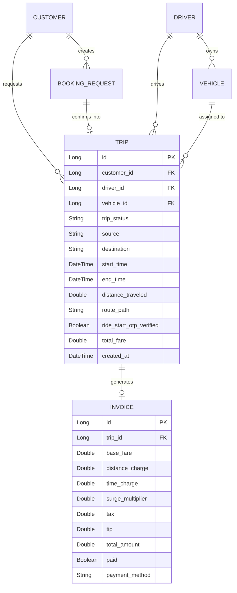
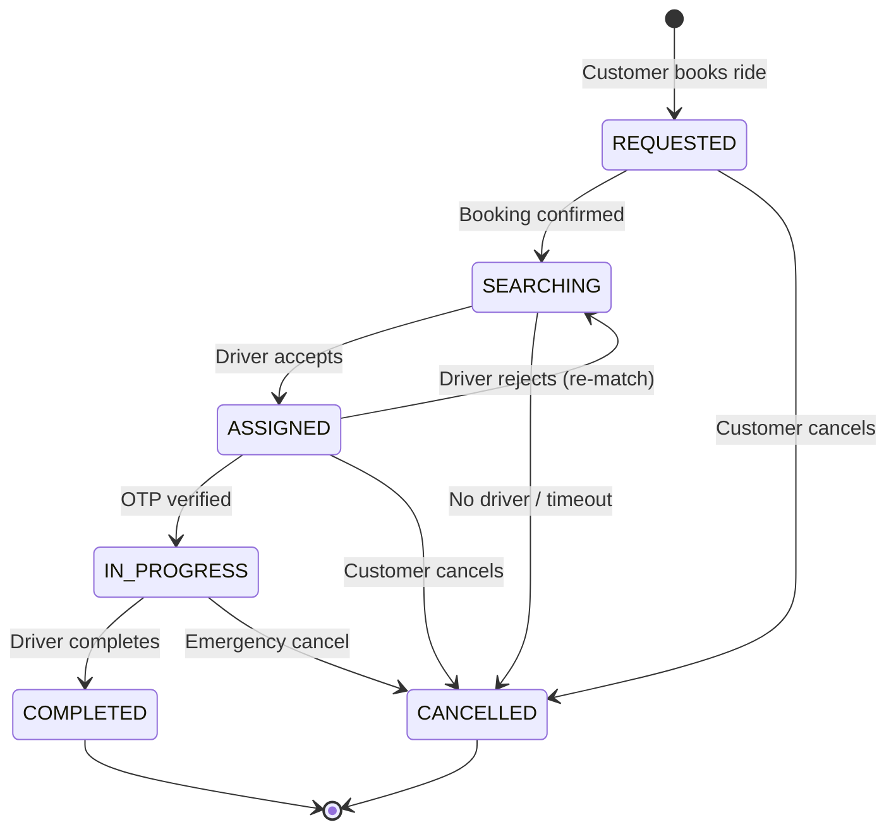
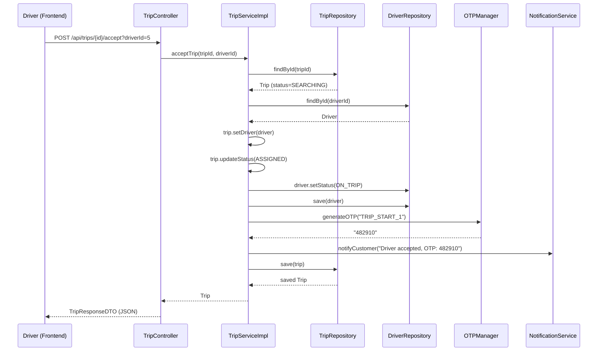
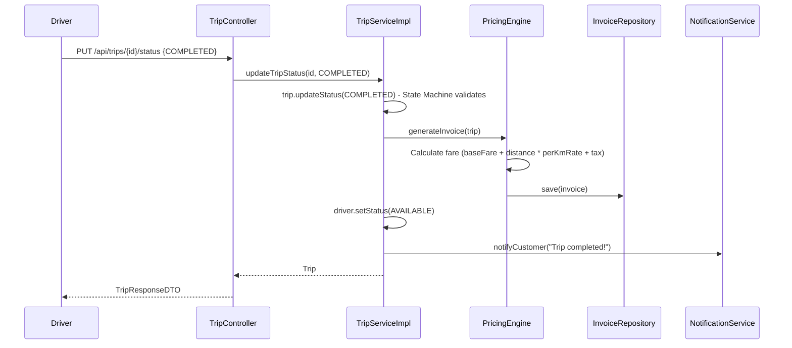

# 🚗 Trips Module — OOAD Documentation

## Scalable Ride-Matching System

> Complete explanation of the Trips module: file structure, design patterns used, data storage, entity relationships, SOLID principles compliance, and potential viva questions.

---

## Table of Contents

1. [Module Overview](#1-module-overview)
2. [All Trip-Related Files & Their Roles](#2-all-trip-related-files--their-roles)
3. [How the Files Are Related — Full Data Flow](#3-how-the-files-are-related--full-data-flow)
4. [Design Patterns Used (with Justification)](#4-design-patterns-used-with-justification)
   - 4.1 [Behavioral Patterns](#41-behavioral-patterns)
   - 4.2 [Structural Patterns](#42-structural-patterns)
   - 4.3 [Creational Patterns](#43-creational-patterns)
5. [SOLID Principles & How We Don't Violate Them](#5-solid-principles--how-we-dont-violate-them)
6. [How Data Is Stored in the Backend (Database Schema)](#6-how-data-is-stored-in-the-backend-database-schema)
7. [Entity Relationship Diagram](#7-entity-relationship-diagram)
8. [State Machine Diagram (Trip Lifecycle)](#8-state-machine-diagram-trip-lifecycle)
9. [Sequence Diagrams (Key Flows)](#9-sequence-diagrams-key-flows)
10. [Possible Teacher Questions & Answers](#10-possible-teacher-questions--answers)

---

## 1. Module Overview

The **Trips module** is the transactional heart of our ride-hailing platform. A `Trip` represents the real-time journey that binds a **Customer**, a **Driver**, and a **Vehicle** together from pickup to drop-off.

**Key Responsibilities:**
- Tracking the lifecycle of a ride (REQUESTED → SEARCHING → ASSIGNED → IN_PROGRESS → COMPLETED/CANCELLED)
- Enforcing valid state transitions via a **State Machine**
- OTP-based ride-start verification for passenger safety
- Live GPS location updates during the trip
- Triggering fare calculation and invoice generation on completion
- Notifying customers at every critical state change

---

## 2. All Trip-Related Files & Their Roles

### Backend (Spring Boot / Java)

| # | File | Layer | Role |
|---|------|-------|------|
| 1 | `Trip.java` | **Model (Entity)** | Core JPA entity — contains the State Machine (`updateStatus()`), relationships to Customer, Driver, Vehicle, Invoice |
| 2 | `TripStatus.java` | **Model (Enum)** | Defines the 6 states: `REQUESTED`, `SEARCHING`, `ASSIGNED`, `IN_PROGRESS`, `COMPLETED`, `CANCELLED` |
| 3 | `TripController.java` | **Controller** | REST API endpoints (`/api/trips/**`) — delegates all logic to `TripService` |
| 4 | `TripService.java` | **Service (Interface)** | Contract/interface for trip operations — enables loose coupling |
| 5 | `TripServiceImpl.java` | **Service (Implementation)** | All business logic: accept, reject, verify OTP, update status, complete trip, GPS updates |
| 6 | `TripRepository.java` | **Repository (DAO)** | Spring Data JPA interface — auto-generates SQL queries from method names |
| 7 | `TripUpdateDTO.java` | **DTO (Request)** | Data Transfer Object for incoming requests (status, geoPoint, otp) |
| 8 | `TripResponseDTO.java` | **DTO (Response)** | Flattened response object sent to frontend — hides internal entity structure |

### Connected Backend Files (Trip depends on these)

| # | File | Role in Trip Context |
|---|------|---------------------|
| 9 | `BookingServiceImpl.java` | **Creates the Trip** — `confirmBooking()` instantiates a `Trip` and sets it to `SEARCHING` |
| 10 | `PricingEngine.java` / `PricingEngineImpl.java` | **Calculates fare & generates Invoice** when trip completes |
| 11 | `NotificationService.java` | **Notifies customer** at every state change (driver accepted, trip started, trip completed) |
| 12 | `OTPManager.java` | **Generates, validates, and invalidates OTPs** for ride-start verification |
| 13 | `Customer.java` | Trip's **passenger** — ManyToOne relationship |
| 14 | `Driver.java` | Trip's **driver** — ManyToOne relationship; status toggled between `AVAILABLE ↔ ON_TRIP` |
| 15 | `Vehicle.java` | Trip's **vehicle** — set from the driver's `activeVehicle` on acceptance |
| 16 | `Invoice.java` | Trip's **billing record** — OneToOne relationship, generated on completion |

### Frontend (React)

| # | File | Role |
|---|------|------|
| 17 | `AvailableTrips.js` | React component — shows drivers the list of `SEARCHING` trips to accept/reject |
| 18 | `api.js` | Axios HTTP client — `tripAPI`, `driverAPI`, `customerAPI` sections all interact with trip endpoints |

---

## 3. How the Files Are Related — Full Data Flow

### 3.1 Trip Creation Flow

```
Customer (Frontend)                Backend
─────────────────                 ───────
BookRide form  ──POST /api/bookings──→  BookingController
                                            │
                                      BookingServiceImpl.createBooking()
                                            │  ← PricingEngine.estimateFare()
                                            ↓
                                      BookingRequest saved (status=REQUESTED)
                                            │
ConfirmBooking ──POST /bookings/{id}/confirm──→  BookingServiceImpl.confirmBooking()
                                            │
                                      new Trip() created
                                      trip.updateStatus(SEARCHING)
                                      TripRepository.save(trip)
                                            │  ← NotificationService.sendEmergencyTripAlert()
                                            ↓
                                      Trip is now SEARCHING (waiting for driver)
```

### 3.2 Driver Accepts & Ride Lifecycle

```
Driver (Frontend)                  Backend
────────────────                  ───────
AvailableTrips.js
  │
  ├─ GET /api/trips/available ──→ TripController.getAvailableTrips()
  │                                   → TripRepository.findByTripStatus(SEARCHING)
  │                                   → Returns list of unassigned trips
  │
  ├─ POST /trips/{id}/accept ──→ TripController.acceptTrip()
  │                                   → TripServiceImpl.acceptTrip()
  │                                       ├─ trip.setDriver(driver)
  │                                       ├─ trip.setVehicle(driver.activeVehicle)
  │                                       ├─ trip.updateStatus(ASSIGNED)  ← State Machine
  │                                       ├─ driver.setDriverStatus(ON_TRIP)
  │                                       ├─ OTPManager.generateOTP("TRIP_START_{id}")
  │                                       └─ NotificationService.notifyCustomer(...)
  │
  ├─ POST /trips/{id}/verify-start-otp ──→ TripServiceImpl.verifyRideStartOtp()
  │                                           ├─ OTPManager.validateOTP()
  │                                           ├─ trip.setRideStartOtpVerified(true)
  │                                           └─ trip.updateStatus(IN_PROGRESS)
  │
  ├─ PUT /trips/{id}/location ──→ TripServiceImpl.updateDriverLocation()
  │                                   └─ driver.setCurrentLocation(geoPoint)
  │
  └─ PUT /trips/{id}/status {COMPLETED} ──→ TripServiceImpl.updateTripStatus()
                                               ├─ trip.updateStatus(COMPLETED) ← State Machine
                                               ├─ PricingEngine.generateInvoice(trip) ← Invoice created
                                               ├─ driver.setDriverStatus(AVAILABLE)
                                               └─ NotificationService.notifyCustomer(...)
```

### 3.3 Layer-by-Layer Architecture

```
┌─────────────────────────────────────────────────────┐
│                  FRONTEND (React)                    │
│  AvailableTrips.js  ←→  api.js (Axios HTTP Client)  │
└──────────────────────────┬──────────────────────────┘
                           │ HTTP REST (JSON)
┌──────────────────────────▼──────────────────────────┐
│               CONTROLLER LAYER                       │
│  TripController.java                                 │
│  • Receives HTTP requests                            │
│  • Delegates to TripService                          │
│  • Converts Entity → TripResponseDTO (toDTO)         │
└──────────────────────────┬──────────────────────────┘
                           │ Method calls
┌──────────────────────────▼──────────────────────────┐
│                SERVICE LAYER                         │
│  TripService.java (interface)                        │
│  TripServiceImpl.java (implementation)               │
│  • All business logic lives here                     │
│  • Orchestrates: Trip + PricingEngine +              │
│    NotificationService + OTPManager                  │
└───────┬──────────┬──────────┬───────────────────────┘
        │          │          │
   ┌────▼────┐ ┌───▼───┐ ┌───▼────┐
   │ Pricing │ │ OTP   │ │ Notif. │
   │ Engine  │ │Manager│ │Service │
   └─────────┘ └───────┘ └────────┘
                           │
┌──────────────────────────▼──────────────────────────┐
│              REPOSITORY LAYER (DAO)                  │
│  TripRepository.java (extends JpaRepository)         │
│  • Auto-generated SQL from method names              │
│  • findByTripStatus, findByDriver, etc.              │
└──────────────────────────┬──────────────────────────┘
                           │ JDBC / Hibernate ORM
┌──────────────────────────▼──────────────────────────┐
│            DATABASE (PostgreSQL)                     │
│  Table: trips                                        │
│  Related: customers, drivers, vehicles, invoices     │
└─────────────────────────────────────────────────────┘
```

---

## 4. Design Patterns Used (with Justification)

### 4.1 Behavioral Patterns

#### 🔁 Pattern 1: State Pattern (in `Trip.java`)

**What it is:** An object changes its behavior based on its internal state, and state transitions are strictly controlled.

**Where it's used:**
```java
// Trip.java — updateStatus() method
public void updateStatus(TripStatus newStatus) {
    if (!isValidTransition(this.tripStatus, newStatus)) {
        throw new IllegalStateException(
            "Invalid trip transition: " + this.tripStatus + " → " + newStatus
        );
    }
    this.tripStatus = newStatus;
    // Auto-set timestamps based on state
    if (newStatus == TripStatus.IN_PROGRESS) {
        this.startTime = LocalDateTime.now();
    } else if (newStatus == TripStatus.COMPLETED || newStatus == TripStatus.CANCELLED) {
        this.endTime = LocalDateTime.now();
    }
}
```

**Valid state transitions:**
| Current State | Allowed Next States |
|---------------|-------------------|
| REQUESTED | SEARCHING, CANCELLED |
| SEARCHING | ASSIGNED, CANCELLED |
| ASSIGNED | IN_PROGRESS, CANCELLED |
| IN_PROGRESS | COMPLETED, CANCELLED |
| COMPLETED | *(none — terminal)* |
| CANCELLED | *(none — terminal)* |

**Why State Pattern?**
- Without it, status changes would be scattered across multiple service methods with `if/else` chains — violating **Single Responsibility Principle (SRP)**.
- The entity *owns* its invariants: you can never set a trip from `REQUESTED` directly to `COMPLETED` — the state machine prevents it.
- New states (e.g., `DRIVER_EN_ROUTE`) can be added by modifying only `isValidTransition()`.

**Why not a full GoF State Pattern with separate state classes?**
- Our state machine is simple (6 states, linear flow) — separate classes per state would be over-engineering (violating KISS). The `switch`-based approach is pragmatic and readable.

---

#### 🔔 Pattern 2: Observer Pattern (via `NotificationService`)

**What it is:** When a subject changes state, all registered observers are notified.

**Where it's used:**
```java
// TripServiceImpl.java — acceptTrip()
notificationService.notifyCustomer(trip.getCustomer().getId(),
    "Your driver " + driver.getFirstName() + " has accepted the ride...");

// TripServiceImpl.java — onTripCompleted()
notificationService.notifyCustomer(trip.getCustomer().getId(),
    "Arrived! Trip completed. You can now view your invoice...");
```

**Why Observer?**
- Decouples notification logic from trip business logic.
- `TripServiceImpl` doesn't know *how* notifications are sent (SMS, push, email) — it just calls `notifyCustomer()`.
- New notification channels can be added without modifying `TripServiceImpl`.

---

#### 🎯 Pattern 3: Strategy Pattern (via `PricingEngine`)

**What it is:** Defines a family of algorithms, encapsulates each one, and makes them interchangeable.

**Where it's used:**
```java
// TripServiceImpl.java — onTripCompleted()
pricingEngine.generateInvoice(trip);

// PricingEngineImpl.java — uses VehicleCategory to select pricing strategy
private double getBaseFare(VehicleCategory category) {
    switch (category) {
        case BIKE:      return 20.0;
        case AUTO:      return 35.0;
        case HATCHBACK: return 60.0;
        case SEDAN:     return 80.0;
        case SUV:       return 120.0;
    }
}
```

**Why Strategy?**
- `PricingEngine` is an **interface** — we can swap `PricingEngineImpl` with `SurgePricingEngine` or `PromoPricingEngine` without touching `TripServiceImpl`.
- Different vehicle categories have different pricing algorithms (base fare + per-km rate).
- Follows **Open/Closed Principle**: open for extension (new pricing strategies), closed for modification.

---

#### 🪖 Pattern 4: Template Method Pattern (in `TripServiceImpl`)

**What it is:** Defines the skeleton of an algorithm in a method, deferring some steps to helper methods.

**Where it's used:**
```java
// TripServiceImpl.java — updateTripStatus() is the template
public Trip updateTripStatus(Long tripId, TripStatus newStatus) {
    Trip trip = getTrip(tripId);                     // Step 1: Fetch
    trip.updateStatus(newStatus);                     // Step 2: Validate + transition

    if (newStatus == TripStatus.COMPLETED) {
        onTripCompleted(trip);                        // Step 3a: Hook for completion
    } else if (newStatus == TripStatus.CANCELLED) {
        onTripCancelled(trip);                        // Step 3b: Hook for cancellation
    }
    return tripRepository.save(trip);                 // Step 4: Persist
}
```

- `onTripCompleted()` and `onTripCancelled()` are **hook methods** — they can be overridden in subclass implementations.

---

### 4.2 Structural Patterns

#### 🏗️ Pattern 5: Facade Pattern (via `TripServiceImpl`)

**What it is:** Provides a simplified interface to a complex subsystem.

**Where it's used:** `TripServiceImpl` acts as a **Facade** over:
- `TripRepository` (data access)
- `DriverRepository` (driver status management)
- `PricingEngine` (fare calculation)
- `NotificationService` (customer notifications)
- `OTPManager` (OTP generation/validation)

The controller just calls `tripService.acceptTrip()` — it doesn't need to know about all 5 subsystems.

---

#### 📦 Pattern 6: Data Transfer Object (DTO) Pattern

**What it is:** An object that carries data between processes to reduce the number of method calls and hide internal structure.

**Where it's used:**
- **Request DTO**: `TripUpdateDTO` — carries `newStatus`, `geoPoint`, `otp` from the API request.
- **Response DTO**: `TripResponseDTO` — flattened response with `customerName`, `driverName`, `vehicleReg` etc.

```java
// TripController.java — toDTO() mapper method
private TripResponseDTO toDTO(Trip t) {
    TripResponseDTO dto = new TripResponseDTO();
    dto.setId(t.getId());
    dto.setSource(t.getSource());
    dto.setCustomerName(t.getCustomer().getFirstName() + " " + t.getCustomer().getLastName());
    dto.setVehicleReg(t.getVehicle().getRegistrationNumber());
    // ... flattens the nested entity graph
    return dto;
}
```

**Why DTO?**
- Prevents exposing JPA entities directly to the API (security risk + LazyInitializationException).
- Flattens nested objects (Customer → name, phone; Vehicle → reg, model) into a single response.
- Decouples API contract from database schema.

---

#### 📐 Pattern 7: Repository Pattern (via Spring Data JPA)

**What it is:** Mediates between the domain and data-mapping layers using a collection-like interface for domain objects.

**Where it's used:**
```java
@Repository
public interface TripRepository extends JpaRepository<Trip, Long> {
    List<Trip> findByTripStatus(TripStatus status);
    Optional<Trip> findByDriverAndTripStatus(Driver driver, TripStatus status);
    List<Trip> findByCustomerOrderByCreatedAtDesc(Customer customer);
    List<Trip> findByDriverOrderByCreatedAtDesc(Driver driver);
}
```

**Why Repository?**
- **Zero SQL written** — Spring auto-generates queries from method names.
- Provides a clean abstraction over data access.
- Easy to switch from PostgreSQL to MongoDB by changing only the repository implementation.

---

#### 🧅 Pattern 8: Layered Architecture Pattern (MVC / 3-Tier)

| Layer | Files | Responsibility |
|-------|-------|---------------|
| **Presentation** | `TripController.java`, `AvailableTrips.js` | HTTP handling, UI rendering |
| **Business Logic** | `TripServiceImpl.java`, `PricingEngineImpl.java` | Rules, validation, orchestration |
| **Data Access** | `TripRepository.java` | Database operations |

Each layer only talks to the layer directly below it — no short-circuiting.

---

### 4.3 Creational Patterns

#### 🏭 Pattern 9: Dependency Injection (IoC Container — Spring)

**What it is:** Objects are not created by the class itself; they are *injected* by a DI container (Spring).

**Where it's used:**
```java
// TripServiceImpl.java — constructor injection
@Autowired
public TripServiceImpl(TripRepository tripRepository,
                        DriverRepository driverRepository,
                        CustomerRepository customerRepository,
                        ParcelRepository parcelRepository,
                        PricingEngine pricingEngine,
                        NotificationService notificationService,
                        OTPManager otpManager) {
    // All dependencies injected, none created with "new"
}
```

**Why DI?**
- `TripServiceImpl` depends on 7 collaborators — without DI, it would need to `new` each one, creating tight coupling.
- Enables **unit testing** with mocks (e.g., mock `PricingEngine` without hitting the real pricing logic).
- Follows **Dependency Inversion Principle**: high-level modules depend on abstractions (`TripService`, `PricingEngine`), not concretions.

---

## 5. SOLID Principles & How We Don't Violate Them

| Principle | How Trips Module Follows It |
|-----------|---------------------------|
| **S — Single Responsibility** | `Trip.java` manages state only. `TripServiceImpl` manages business orchestration. `TripController` handles HTTP only. `PricingEngine` handles pricing only. |
| **O — Open/Closed** | New trip statuses or pricing strategies can be added without modifying existing classes (extend via new implementations). |
| **L — Liskov Substitution** | `TripServiceImpl` implements `TripService` — any substitute implementation would work without breaking the controller. |
| **I — Interface Segregation** | `TripService` interface has only trip-related methods. `PricingEngine` is separate. `NotificationService` is separate. No "God interface." |
| **D — Dependency Inversion** | Controller depends on `TripService` (interface), not `TripServiceImpl` (concrete). Same for `PricingEngine`, `NotificationService`. |

### "Doesn't the State Pattern inside the entity violate SRP?"

**No.** The `Trip` entity owns its *invariants* — a trip is responsible for knowing which state transitions are valid. This is domain logic that *belongs* in the entity (Domain-Driven Design). The *side effects* of state transitions (notifications, pricing) are delegated to services.

### "Doesn't TripServiceImpl having 7 dependencies violate SRP?"

**No.** `TripServiceImpl` is an **orchestrator/facade** — its single responsibility is *coordinating* the trip lifecycle. It doesn't implement pricing, notifications, or OTP logic itself; it delegates to specialized services.

---

## 6. How Data Is Stored in the Backend (Database Schema)

### ORM: Hibernate / Spring Data JPA → PostgreSQL

The entities are mapped to database tables via JPA annotations. Hibernate auto-generates the DDL from entity classes.

### `trips` Table

| Column | Type | Source in `Trip.java` | Notes |
|--------|------|----------------------|-------|
| `id` | `BIGINT (PK, AUTO)` | `@Id @GeneratedValue` | Primary key |
| `customer_id` | `BIGINT (FK → customers)` | `@ManyToOne` | Foreign key to customers table |
| `driver_id` | `BIGINT (FK → drivers)` | `@ManyToOne` | Nullable — NULL until a driver accepts |
| `vehicle_id` | `BIGINT (FK → vehicles)` | `@ManyToOne` | Set from driver's activeVehicle |
| `trip_status` | `VARCHAR` | `@Enumerated(EnumType.STRING)` | Stored as string: "SEARCHING", "ASSIGNED", etc. |
| `source` | `VARCHAR` | plain field | Pickup address or coordinates |
| `destination` | `VARCHAR` | plain field | Drop-off address or coordinates |
| `start_time` | `TIMESTAMP` | `LocalDateTime` | Auto-set when status → IN_PROGRESS |
| `end_time` | `TIMESTAMP` | `LocalDateTime` | Auto-set when status → COMPLETED/CANCELLED |
| `distance_traveled` | `DOUBLE` | plain field | Distance in km |
| `route_path` | `TEXT` | plain field | JSON array of GPS waypoints |
| `ride_start_otp_verified` | `BOOLEAN` | `Boolean` | True after OTP verification |
| `total_fare` | `DOUBLE` | plain field | Set by PricingEngine on completion |
| `created_at` | `TIMESTAMP` | `@PrePersist` | Auto-set on entity creation |

### Related Tables

| Table | Relationship to `trips` | FK Column |
|-------|------------------------|-----------|
| `customers` | One Customer → Many Trips | `customer_id` in trips |
| `drivers` | One Driver → Many Trips | `driver_id` in trips |
| `vehicles` | One Vehicle → Many Trips | `vehicle_id` in trips |
| `invoices` | One Trip → One Invoice | `trip_id` in invoices |

### How `TripStatus` is Stored

```java
@Enumerated(EnumType.STRING)
private TripStatus tripStatus = TripStatus.REQUESTED;
```

- **`EnumType.STRING`** → Stored as human-readable text (e.g., `"COMPLETED"`) instead of ordinal numbers.
- This is important for debugging and data readability.

### Auto-Generated Queries (Spring Data JPA)

Spring generates SQL from repository method names at startup:

| Repository Method | Generated SQL |
|-------------------|--------------|
| `findByTripStatus(SEARCHING)` | `SELECT * FROM trips WHERE trip_status = 'SEARCHING'` |
| `findByDriverAndTripStatus(driver, IN_PROGRESS)` | `SELECT * FROM trips WHERE driver_id = ? AND trip_status = 'IN_PROGRESS'` |
| `findByCustomerOrderByCreatedAtDesc(customer)` | `SELECT * FROM trips WHERE customer_id = ? ORDER BY created_at DESC` |

---

## 7. Entity Relationship Diagram



---

## 8. State Machine Diagram (Trip Lifecycle)



---

## 9. Sequence Diagrams (Key Flows)

### 9.1 Driver Accepts Trip



### 9.2 Trip Completion



---

## 10. Possible Teacher Questions & Answers

### Design Pattern Questions

**Q1: What design pattern is used in `Trip.java` for managing status changes?**
> **A:** The **State Pattern**. The `updateStatus()` method enforces a finite state machine that only allows valid transitions. Invalid transitions throw `IllegalStateException`.

**Q2: Why didn't you use separate state classes (full GoF State Pattern)?**
> **A:** Our state machine has only 6 states with a linear flow. Creating 6 separate classes would be over-engineering. The `switch`-based approach in `isValidTransition()` is more readable and maintainable for this complexity level. If we had 15+ states with complex branching, separate state classes would make more sense.

**Q3: What structural pattern does `TripServiceImpl` represent?**
> **A:** The **Facade Pattern**. It provides a simplified interface over 5 subsystems: `TripRepository`, `DriverRepository`, `PricingEngine`, `NotificationService`, and `OTPManager`.

**Q4: How does the Strategy Pattern apply to pricing?**
> **A:** `PricingEngine` is an interface with `estimateFare()` and `generateInvoice()`. Currently, `PricingEngineImpl` handles standard pricing. We can create `SurgePricingEngine`, `DiscountPricingEngine`, etc., and swap them via Spring DI without modifying `TripServiceImpl`.

**Q5: What creational pattern is used throughout the project?**
> **A:** **Dependency Injection (DI)**. Spring's IoC container injects all dependencies via constructor injection. `TripServiceImpl` receives 7 dependencies without ever calling `new`.

**Q6: Is DTO a design pattern?**
> **A:** Yes, it's a **Structural pattern** (Martin Fowler's Enterprise Patterns). `TripResponseDTO` and `TripUpdateDTO` decouple the API layer from the persistence layer. Without DTOs, changing the `Trip` entity would break the API contract.

**Q7: Where is the Observer pattern used?**
> **A:** `NotificationService` — whenever the trip state changes (accepted, started, completed), the service "observes" the change and notifies the customer. The trip lifecycle triggers notifications without the `Trip` entity knowing how notifications work.

---

### Architecture & Layer Questions

**Q8: Why is `TripService` an interface?**
> **A:** To follow the **Dependency Inversion Principle (DIP)**. The controller depends on the abstraction (`TripService`), not the concrete implementation (`TripServiceImpl`). This allows us to swap implementations (e.g., `MockTripService` for testing) without changing the controller.

**Q9: Why doesn't the controller directly access the repository?**
> **A:** That would violate the **Layered Architecture Pattern**. The controller should only handle HTTP concerns (parsing requests, returning responses). Business logic (validation, state transitions, notifications) belongs in the service layer. Direct repository access in the controller leads to duplicated logic and untestable code.

**Q10: Why do you convert entities to DTOs in the controller?**
> **A:** Three reasons: (1) **Security** — we don't expose internal entity fields like password hashes. (2) **Avoiding LazyInitializationException** — JPA lazy-loaded fields would fail outside a transaction. (3) **API stability** — the DTO acts as a contract; internal entity changes don't break the API.

---

### State Machine Questions

**Q11: What happens if someone tries to complete a trip directly from REQUESTED?**
> **A:** The `isValidTransition()` method returns `false`, and `updateStatus()` throws `IllegalStateException("Invalid trip transition: REQUESTED → COMPLETED")`. The trip state remains unchanged.

**Q12: Can a completed trip be cancelled?**
> **A:** No. `COMPLETED` and `CANCELLED` are terminal states. The `isValidTransition()` switch falls to `default: return false` for both.

**Q13: What happens when a driver rejects a trip?**
> **A:** If the trip is `ASSIGNED`, it goes back to `SEARCHING` (`trip.updateStatus(TripStatus.SEARCHING)`), the driver and vehicle references are set to `null`, and the trip reappears in the available trips list for other drivers.

**Q14: Why is `ASSIGNED → SEARCHING` (rejection) allowed but `SEARCHING → ASSIGNED` requires explicit driver acceptance?**
> **A:** This is the **Marketplace Model**. Unassigned trips sit in `SEARCHING` and any available driver can claim them. If a driver rejects, the trip returns to the marketplace. This avoids a central dispatch engine and lets drivers self-select.

---

### OTP & Security Questions

**Q15: Why is OTP required to start a trip?**
> **A:** For **passenger safety**. The OTP ensures the customer is physically present with the correct driver before the trip begins. Without OTP, a driver could start a trip without the passenger and charge them.

**Q16: How is OTP stored and validated?**
> **A:** `OTPManager` uses a `ConcurrentHashMap<String, OTPRecord>` with context keys like `"TRIP_START_5"`. Each OTP has a 300-second expiry. After validation, `invalidateOTP()` removes it to prevent replay attacks.

**Q17: Why in-memory OTP storage instead of database?**
> **A:** OTPs are short-lived (5 min). Persisting them to a database adds unnecessary I/O overhead. In production, we'd use **Redis** (in-memory store) for distributed OTP management. The `OTPManager` class is designed to be easily replaceable.

---

### Database & JPA Questions

**Q18: How is `TripStatus` stored in the database?**
> **A:** As a `VARCHAR` string (e.g., `"COMPLETED"`) using `@Enumerated(EnumType.STRING)`. We chose `STRING` over `ORDINAL` because ordinal values break if we reorder enum constants.

**Q19: Why is `FetchType.LAZY` used for Customer and Driver?**
> **A:** **Performance optimization.** A trip lists customer and driver, but we don't always need their full data. Lazy loading fetches them only when accessed. `FetchType.EAGER` for `Vehicle` is intentional — vehicle info is almost always needed when displaying a trip.

**Q20: How does `@PrePersist` work in Trip?**
> **A:** It's a JPA lifecycle callback. Before Hibernate inserts a new `Trip` row, it automatically calls `onCreate()` which sets `createdAt = LocalDateTime.now()`. This ensures every trip has a timestamp without manual intervention.

**Q21: How does Spring Data JPA generate queries from method names?**
> **A:** Spring parses method names at startup. `findByTripStatus(status)` becomes `SELECT * FROM trips WHERE trip_status = ?`. `findByCustomerOrderByCreatedAtDesc(customer)` becomes `SELECT * FROM trips WHERE customer_id = ? ORDER BY created_at DESC`. No SQL written by us.

**Q22: What is `CascadeType.ALL` on the Invoice relationship?**
> **A:** When a Trip is saved/deleted, the associated Invoice is automatically saved/deleted too. This cascading ensures data consistency — an Invoice cannot exist without its Trip.

---

### Data Flow & Business Logic Questions

**Q23: How is a Trip created?**
> **A:** Via `BookingServiceImpl.confirmBooking()`. It creates a new `Trip()` object, sets the customer from the booking, copies source/destination, transitions status to `SEARCHING`, and saves it via `TripRepository`. The trip is now visible to drivers.

**Q24: How does fare calculation work?**
> **A:** When a trip completes, `PricingEngineImpl.generateInvoice()` is called. It gets the distance (from trip or simulated), looks up base fare and per-km rate by `VehicleCategory` (BIKE=₹20+₹6/km, SEDAN=₹80+₹16/km, etc.), adds 5% GST tax, creates an `Invoice` entity, and persists it.

**Q25: How are GPS locations updated during a trip?**
> **A:** The driver's frontend periodically calls `PUT /api/trips/{id}/location` with a `geoPoint` (e.g., `"12.9716,77.5946"`). `TripServiceImpl.updateDriverLocation()` updates `driver.currentLocation` and saves it via `DriverRepository`.

---

### SOLID & Clean Code Questions

**Q26: Does `TripServiceImpl` having 7 dependencies violate SRP?**
> **A:** No. `TripServiceImpl` is a **coordinator/orchestrator** — its single responsibility is managing the trip lifecycle. It doesn't implement pricing, notifications, or OTP logic; it delegates to specialized services. Each dependency handles one concern.

**Q27: How does the project follow the Open/Closed Principle?**
> **A:** `PricingEngine` is an interface. New pricing strategies can be added by implementing the interface (extension) without modifying `TripServiceImpl` (closed for modification). Similarly, `NotificationService` can get new implementations (SMS, push, email) without changing trip logic.

**Q28: How does Dependency Inversion apply here?**
> **A:** `TripController` depends on `TripService` (interface), not `TripServiceImpl`. `TripServiceImpl` depends on `PricingEngine` (interface), not `PricingEngineImpl`. High-level modules never depend on low-level modules; both depend on abstractions.

**Q29: How does Interface Segregation apply?**
> **A:** We don't have one giant `IService` interface. Instead: `TripService` (trip ops), `PricingEngine` (pricing ops), `NotificationService` (notification ops), `BookingService` (booking ops). Each client depends only on the methods it needs.

---

### Frontend & API Questions

**Q30: How does the frontend get available trips?**
> **A:** `AvailableTrips.js` calls `GET /api/trips/available` every 5 seconds via polling (`setInterval`). The backend returns all trips with `status = SEARCHING`. This is a simple pull-based approach; in production, we'd use WebSockets for real-time updates.

**Q31: Why is there both `tripAPI` and `driverAPI` in `api.js`?**
> **A:** `tripAPI` is a generic trip API. `driverAPI` wraps driver-specific operations (accept, reject, OTP verify, location update) that use the same backend endpoints but are organized by user role in the frontend for readability.

**Q32: How does the frontend handle trip acceptance race conditions?**
> **A:** When two drivers try to accept the same trip simultaneously, the backend's `@Transactional` annotation ensures only one succeeds. The second driver gets an error response ("Trip has already been claimed by another driver"), which is displayed as a toast notification.

---

### Advanced / Edge Case Questions

**Q33: What happens if the driver's app crashes mid-trip?**
> **A:** The trip remains in `IN_PROGRESS` state. When the driver reconnects, they can fetch their current trip via `findByDriverAndTripStatus(driver, IN_PROGRESS)` and resume updating location/completing the trip.

**Q34: What if the OTP expires before the driver enters it?**
> **A:** `OTPManager.validateOTP()` checks the expiry timestamp. If expired (>300 seconds), it returns `false` and removes the OTP from the store. The customer sees "Ride OTP expired. Ask driver to re-accept trip." The trip would need to be re-accepted to generate a new OTP.

**Q35: Why is `@Transactional` used on service methods?**
> **A:** It ensures atomicity. If `acceptTrip()` fails midway (e.g., saving the driver fails), the entire transaction rolls back — the trip won't be left in an inconsistent state (assigned but driver not updated).

**Q36: How does the system handle parcel delivery differently from ride completion?**
> **A:** Parcel trips use `completeParcelDelivery()` which requires an additional delivery OTP verification via `Parcel.verifyOtp()`. Regular ride completion just needs the trip to be `IN_PROGRESS` with `rideStartOtpVerified = true`.

**Q37: Why store `trip_status` as STRING instead of ORDINAL?**
> **A:** Ordinal uses the enum's index position (0, 1, 2...). If we reorder the enum or add a value in the middle, all existing data becomes corrupted. STRING storage (`"COMPLETED"`) is self-documenting and resistant to enum reordering.

**Q38: Can you explain the MVC pattern in the context of trips?**
> **A:** **Model**: `Trip.java` + `TripStatus.java` (domain entities). **View**: `AvailableTrips.js` + `TripResponseDTO` (presentation layer). **Controller**: `TripController.java` (handles HTTP, delegates to service). The service layer sits between Controller and Model, following the refined **MVC + Service Layer** architecture.

**Q39: What if a new feature requires adding a `DRIVER_EN_ROUTE` state?**
> **A:** 1. Add `DRIVER_EN_ROUTE` to `TripStatus.java` enum. 2. Add transition rules in `Trip.isValidTransition()` (e.g., `ASSIGNED → DRIVER_EN_ROUTE → IN_PROGRESS`). 3. Handle side effects in `TripServiceImpl.updateTripStatus()`. No changes needed in Controller, Repository, or DTOs (unless the frontend needs to render it differently).

**Q40: Why use constructor injection instead of field injection (`@Autowired` on fields)?**
> **A:** Constructor injection makes dependencies **explicit and immutable**. The object cannot be created without all dependencies (compile-time safety). Field injection allows creating objects in an invalid state and makes testing harder since you need reflection to set private fields.

---

## Summary of All Design Patterns

| Category | Pattern | Where Applied |
|----------|---------|---------------|
| **Behavioral** | State | `Trip.updateStatus()` — finite state machine |
| **Behavioral** | Observer | `NotificationService` — notifies on state changes |
| **Behavioral** | Strategy | `PricingEngine` — swappable pricing algorithms |
| **Behavioral** | Template Method | `updateTripStatus()` with hooks `onTripCompleted()`/`onTripCancelled()` |
| **Structural** | Facade | `TripServiceImpl` — simplified interface over 5 subsystems |
| **Structural** | DTO | `TripResponseDTO` / `TripUpdateDTO` — decouples API from entities |
| **Structural** | Repository | `TripRepository` — clean data access abstraction |
| **Structural** | Layered Architecture (MVC) | Controller → Service → Repository → Database |
| **Creational** | Dependency Injection | Spring IoC constructor injection throughout |
